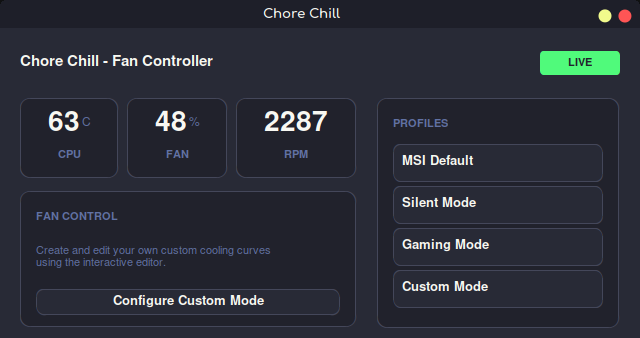
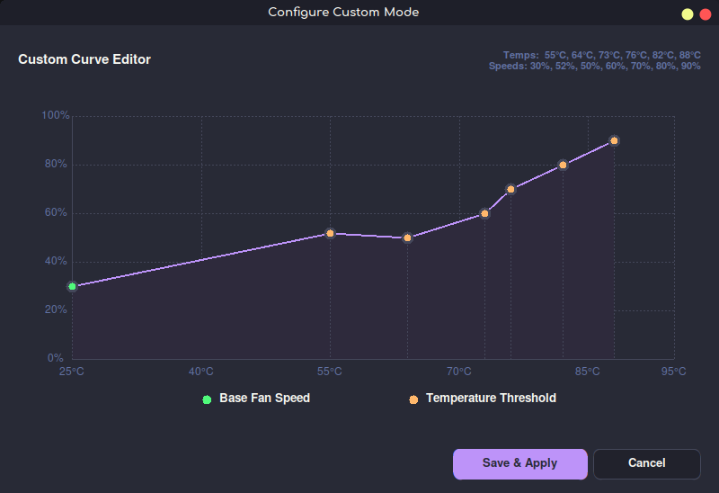

# Chore Chill CTL

> A handmade fan control daemon for Linux, built to save an old MSI GF63 Thin from dying.



Controls fan speed by writing directly to the **Embedded Controller (EC)** via `/sys/kernel/debug/ec/ec0/io`. CPU temperature is read from the kernel thermal subsystem (`/sys/class/thermal/`) with EC as fallback.

> [!NOTE]
> **TL;DR**
> - **What:** Modular fan control daemon for Linux laptops.
> - **How:** C daemon (`chorechill-ctl`) loads a hardware-specific driver plugin at startup; Python GUI (`chorechill`) controls it via a UNIX socket.
> - **Prerequisites:** Secure Boot **disabled** (kernel lockdown off) + `ec_sys` module loaded with write support.
> - **Setup:** Install the `.deb` package. The installer detects your motherboard and activates the right plugin automatically.

---

## Table of Contents

- [Architecture](#architecture)
- [IPC Protocol](#ipc-protocol)
- [Prerequisites](#prerequisites)
- [Setup & Installation](#setup--installation)
- [How EC Addresses Were Found](#how-ec-addresses-were-found)
- [Compatibility](#compatibility)
- [Roadmap](#roadmap)
- [References](#references)

---

## Architecture

```
chorechill-ctl/
├── debian/                         # Debian packaging metadata
│   ├── control                     # Package name, deps, description
│   ├── rules                       # Build rules (debhelper)
│   ├── postinst                    # Post-install: ec_sys config, detection, systemd
│   ├── prerm / postrm              # Pre/post removal cleanup
│   └── changelog                   # Package version history
├── Makefile                        # Targets: all / plugins / detect / deb / clean
├── README.md                       # You are here
├── How2Get_Good_Addresses.md       # EC investigation guide (hexdump method)
├── config/
│   ├── profiles.json               # Fan curve profiles (default, silent, gaming, custom)
│   └── chorechill-ctl.service      # Systemd unit file (reference copy)
├── backend/
│   ├── detect/
│   │   └── chorechill-detect.c     # Reads /sys/class/dmi/id/ and outputs the right plugin name
│   ├── include/
│   │   ├── driver_plugin.h         # Plugin API struct (contract all plugins must implement)
│   │   ├── plugin_loader.h         # load_plugin() / unload_plugin() declarations
│   │   ├── ipc.h                   # UNIX socket IPC declarations
│   │   └── profiles.h              # Fan curve profile parser declarations
│   ├── plugins/
│   │   └── msi_modern/
│   │       └── plugin_msi_modern.c # EC driver for MSI GF63 Thin / MS-16R4, MS-16R5
│   ├── compiled/                   # Output directory for built daemon binary
│   └── src/
│       ├── main.c                  # Daemon entrypoint: plugin selection, main loop
│       ├── plugin_loader.c         # dlopen/dlsym runtime plugin loader
│       ├── ipc.c                   # UNIX socket server, routes commands to plugin
│       └── profiles.c              # Parses SET_CURVE payload, calls plugin->apply_custom_curve()
└── frontend/                       # Python GUI (runs as regular user)
    ├── requirements.txt
    └── src/
        ├── main.py                 # Entrypoint: wires IPC + UI + telemetry polling
        ├── gui/
        │   └── frontend.py         # Main window + CustomCurveEditor popup (customtkinter)
        └── ipc/
            └── main.py             # UNIX socket client: talks to C daemon
```

---

## IPC Protocol

The frontend and daemon communicate over a UNIX socket at `/tmp/chorechill-ctl.sock`.

| Command | Direction | Description |
|---|---|---|
| `GET` | frontend -> daemon | Poll current telemetry |
| `SET:<pct>` | frontend -> daemon | Lock fan at `<pct>`%: daemon keeps re-writing every 100 ms to hold the EC |
| `SET_CURVE:<t1,...,t6>;<s1,...,s7>` | frontend -> daemon | Push a fan curve into EC registers; EC runs it autonomously, re-write loop stops |

All commands return `<temp_c>,<fan_pct>,<rpm>` as the response.

> **Why the re-write loop?** The EC has its own thermal algorithm. Writing once to the fan speed register (`0x71`) only works for a few seconds because the EC overrides it. The daemon re-writes every 100 ms to hold manual mode. `SET_CURVE` writes to the curve registers (`0x6A-0x78`) which the EC enforces autonomously, so no re-write is needed.

---

## Prerequisites

- Linux with `ec_sys` kernel module available
- **Secure Boot must be disabled** (otherwise kernel lockdown blocks EC access)
- Python 3 + `python3-tk`
- GCC + `libcjson-dev`

Verify Secure Boot / lockdown status:
```bash
cat /sys/kernel/security/lockdown
# [none]  -> OK
# [integrity] or [confidentiality] -> disable Secure Boot in BIOS first
```

---

## Setup & Installation

### Option A: Debian Package (Recommended)

The `.deb` installer handles everything: dependencies, `ec_sys` configuration, motherboard detection, and systemd service registration.

```bash
# Build the package
make deb

# Install
sudo dpkg -i chorechill-ctl_*.deb
sudo apt-get install -f
```

During installation, `chorechill-detect` reads your DMI tables and automatically selects the correct driver plugin for your motherboard.

### Option B: Manual Build (Development)

```bash
# Compile daemon, plugins, and detect utility
make all
make plugins
make detect

# Then run the legacy installer
sudo bash install.sh
```

### Running the GUI

```bash
chorechill
```

You can select standard cooling profiles or design a custom fan curve using the **Custom Curve Editor**:



### Managing the Daemon (Systemd)

```bash
sudo systemctl status chorechill-ctl
sudo systemctl restart chorechill-ctl
sudo systemctl stop chorechill-ctl
```

---

## How EC Addresses Were Found

The Embedded Controller exposes 256 bytes of RAM at `/sys/kernel/debug/ec/ec0/io`.

### Method: hexdump differential analysis

```bash
# Baseline snapshot (idle, fans quiet)
sudo hexdump -C /sys/kernel/debug/ec/ec0/io > idle.txt

# Trigger load (e.g. a heavy compile or Docker stack)
sudo hexdump -C /sys/kernel/debug/ec/ec0/io > load.txt

# Compare
diff idle.txt load.txt
```

Bytes that spike under load -> fan speed registers.
Bytes that increase with heat -> temperature registers.

### Validated addresses (MSI GF63 Thin / MS-16R4)

| Component | Address | Access | Notes |
|---|---|---|---|
| CPU Temperature | `0x68` | Read | Fallback only; primary source is `/sys/class/thermal/` |
| CPU Fan Speed | `0x71` | Read/Write | 0-100 % duty cycle |
| Fan Curve Temps | `0x6A-0x6F` | Write | 6 temperature thresholds (°C) |
| Fan Curve Speeds | `0x72-0x78` | Write | 7 speed percentages (%) |
| Fan Mode | `0xF4` | Write | 0 = auto, 1 = manual |
| GPU Temperature | `0x80` | Read | 0x00 when GPU is in standby |
| GPU Fan Speed | `0x89` | Read/Write | 0x00 when GPU fan is off |

> The EC has its own control loop: writing a curve to `0x6A-0x78` makes the EC enforce it automatically. For a manual lock (`SET:<pct>`), the daemon writes directly to `0x71` and keeps re-writing every 100 ms.

For full investigation steps, see [How2Get_Good_Addresses.md](./How2Get_Good_Addresses.md).

---

## Compatibility

- **Validated:** MSI GF63 Thin (MS-16R4, GF63 Thin 10SCXR) — full read/write access confirmed.
- **Likely compatible:** Other recent MSI GF/GS series sharing the same EC layout (MS-16R5, MS-16S, MS-17E). Run `chorechill-detect` to check.
- **Other brands:** Not supported out of the box. The plugin architecture makes it straightforward to add new drivers:
  1. Investigate your EC registers with the [hexdump guide](./How2Get_Good_Addresses.md).
  2. Implement `driver_plugin_t` in a new `.c` file under `backend/plugins/`.
  3. Add your board name to the lookup table in `backend/detect/chorechill-detect.c`.

> [!NOTE]
> EC write access requires `ec_sys` loaded with `write_support=1` and Secure Boot disabled.

---

## Roadmap

- [x] Graphical fan curve editor (7 draggable points).
- [x] Plugin-based driver architecture (`driver_plugin_t` + `dlopen` loader).
- [x] CPU temperature via `/sys/class/thermal/` (x86_pkg_temp > acpitz > EC fallback).
- [x] DMI-based hardware auto-detection (`chorechill-detect`).
- [x] Full Debian packaging (`debian/` directory, `make deb`).
- [ ] First signed `.deb` release.
- [ ] Additional plugins: MSI legacy, ASUS WMI, Lenovo ACPI.

See [backend/ROADMAP.md](./backend/ROADMAP.md) for the detailed technical roadmap.

---

## References

- [MSI WMI Platform - kernel docs](https://docs.kernel.org/wmi/devices/msi-wmi-platform.html)
- [`ec_sys` module - kernel docs](https://www.kernel.org/doc/html/latest/admin-guide/acpi/ec_access.html)